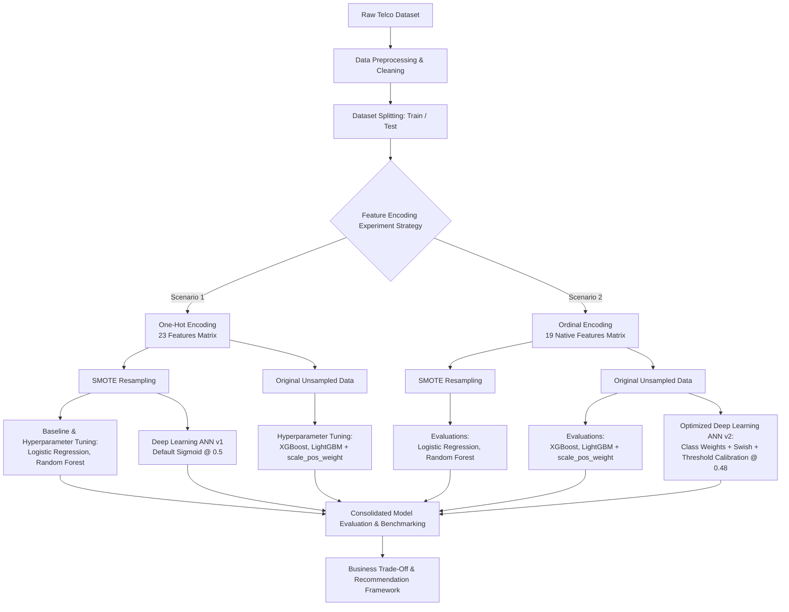

  
[1]: https://github.com/mherlypratama
[2]: https://www.linkedin.com/in/mherlypratama/

[][1]
[][2]

# 
Customer Churn Prediction: Machine Learning & Deep Learning Approach

## About The Project

This project focuses on building an end-to-end predictive framework to accurately identify customers who are at risk of churning (canceling their subscription/service). By leveraging a combination of traditional Machine Learning algorithms, hyperparameter tuning, and Deep Learning architectures, this project aims to evaluate and compare different modeling techniques to determine the optimal solution for proactive customer retention.

## Project Background

Customer acquisition is significantly more expensive than customer retention. In competitive industries such as telecommunications, customer loss directly leads to substantial revenue degradation. Identifying early warning signals of churn enables businesses to implement targeted retention strategies, personalize customer outreach, and optimize marketing spending. By shifting from a reactive to a proactive strategy driven by data, companies can preserve customer lifetime value (CLV) and maintain sustainable business growth.

## Project Objectives

- **Predictive Accuracy & Recall Optimization:** Develop machine learning and deep learning models that effectively detect potential churners, focusing particularly on maximizing recall/ROC-AUC to minimize false negatives (unidentified churners).
- **Hyperparameter Optimization:** Conduct systematic hyperparameter tuning to refine model performance and prevent overfitting.
- **Model Comparison:** Compare baseline statistical models, ensemble machine learning methods (e.g., XGBoost, LightGBM, Random Forest), and Neural Networks/Deep Learning architectures to find the best performing pipeline.
- **Business Impact & Decision Making:** Translate model predictions into actionable business insights that optimize retention campaigns and mitigate revenue loss.

---

## Dataset Overview

The dataset contains **7,043 customer records** with **21 feature columns**, capturing customer demographics, subscribed services, account details, and churn status.

[Dataset](https://github.com/mherlypratama/Churn-Prediction/blob/main/Scripts/data.csv)

### Feature Description

- **Customer Demographic Information:**

  - `customerID`: Unique identifier for each customer.
  - `gender`: Gender of the customer (`Male`, `Female`).
  - `SeniorCitizen`: Whether the customer is a senior citizen (`1`, `0`).
  - `Partner`: Whether the customer has a partner (`Yes`, `No`).
  - `Dependents`: Whether the customer has dependents (`Yes`, `No`).

- **Subscribed Services:**

  - `tenure`: Number of months the customer has stayed with the company.
  - `PhoneService`: Whether the customer has a phone service (`Yes`, `No`).
  - `MultipleLines`: Whether the customer has multiple lines (`Yes`, `No`, `No phone service`).
  - `InternetService`: Customer’s internet service provider (`DSL`, `Fiber optic`, `No`).
  - `OnlineSecurity`, `OnlineBackup`, `DeviceProtection`, `TechSupport`, `StreamingTV`, `StreamingMovies`: Additional services subscribed (`Yes`, `No`, `No internet service`).

- **Account & Financial Information:**

  - `Contract`: The contract term of the customer (`Month-to-month`, `One year`, `Two year`).
  - `PaperlessBilling`: Whether the customer has paperless billing (`Yes`, `No`).
  - `PaymentMethod`: Payment method (`Electronic check`, `Mailed check`, `Bank transfer (automatic)`, `Credit card (automatic)`).
  - `MonthlyCharges`: The amount charged to the customer monthly.
  - `TotalCharges`: The total amount charged to the customer (Note: Requires data type conversion from `object` to `float`).

- **Target Variable:**
  - `Churn`: Whether the customer churned or not (`Yes`, `No`).

---

## Expected Project Deliverables & Results

1. **Exploratory Data Analysis (EDA):** Insights into key drivers of churn (e.g., contract types, tenure, monthly charges).
2. **Data Preprocessing & Feature Engineering Pipeline:** Cleaned data handling missing values, encoding categorical variables, scaling, and feature transformation.
3. **Machine Learning & Deep Learning Benchmarks:** A structured comparison matrix comparing evaluation metrics (Accuracy, Precision, Recall, F1-Score, ROC-AUC) across multiple models.
4. **Tuned & Finalized Prediction Model:** An optimized, production-ready model artifact capable of predicting churn probability for new customer data.
5. **Business Recommendations:** Practical data-driven strategies to improve customer retention based on feature importance and model insights.

# End-to-End Customer Churn Prediction & Model Optimization

## Executive Summary

Customer churn poses a critical financial risk in the telecommunications industry, where acquiring new customers costs significantly more than retaining existing ones. This project delivers an end-to-end Machine Learning and Deep Learning pipeline designed to identify potential churners early, enabling data-driven customer retention strategies.

Rather than relying on a single baseline, this repository documents an empirical, hypothesis-driven experimentation framework comparing:

1. **Feature Engineering Strategies:** One-Hot Encoding (23 features) vs. Ordinal Encoding (19 native features).
2. **Imbalance Mitigation:** Synthetic Oversampling (SMOTE) vs. Cost-Sensitive Weighting (`scale_pos_weight` / `class_weight`).
3. **Model Families:** Regularized Linear Models (Logistic Regression), Bagging (Random Forest), Gradient Boosting (XGBoost & LightGBM), and Deep Neural Networks (Multi-Layer Perceptron).

---

## Technical Pipeline & Experiment Architecture

---

## 1. Data Cleaning & Preprocessing

The dataset consists of Telco customer records containing demographic, account, and service usage attributes. Preprocessing steps applied prior to modeling include:

- **Handling Missing & Invalid Values:**
  - `TotalCharges` contained whitespace strings for new customers with `tenure = 0`. These values were coerced to numeric `0.0`.
- **Feature Hygiene:**
  - Non-informative unique identifiers (`customerID`) were removed.
  - Categorical redundancies were standardized (e.g., `'No internet service'` and `'No phone service'` were mapped to `'No'`).
- **Data Splitting:**
  - The dataset was partitioned into Training (80%) and Test (20%) sets using stratified sampling to preserve the target class balance ($y = \text{Churn}$).

---

## 2. Feature Encoding Strategy: Scenario 1 vs. Scenario 2

To evaluate the impact of feature matrix dimensionality on model partition decisions, two distinct encoding approaches were engineered:

### Scenario 1: One-Hot Encoding (OHE)

- Categorical attributes were transformed into dummy binary variables, expanding the feature space from **19 to 23 features**.
- **Impact:** Created high-dimensional sparse representations, causing feature fragmentation during tree-node splits in ensemble algorithms.

### Scenario 2: Ordinal Encoding (Native Feature Preservation)

- Categorical features were ordinal-encoded within their single native columns, preserving the **19-feature shape**.
- Numerical features (`tenure`, `MonthlyCharges`, `TotalCharges`) were normalized using `StandardScaler`.
- **Impact:** Retained structural feature integrity, allowing tree-based algorithms (XGBoost, LightGBM, Random Forest) to evaluate split boundaries holistically.

---

## 3. Class Imbalance Mitigation Approaches

The target variable exhibits a class imbalance ratio of approximately **73:27** (Majority Class `0` vs. Minority Class `1`). Two primary techniques were benchmarked:

1. **Synthetic Minority Over-sampling Technique (SMOTE):**
   - Applied exclusively to training partitions (`X_train_resampled`) for linear models (Logistic Regression), bagging trees (Random Forest), and initial deep neural networks (ANN v1).
2. **Cost-Sensitive Weight Scaling (`scale_pos_weight` & `class_weight`):**
   - Applied to gradient boosting algorithms (XGBoost & LightGBM) and optimized neural networks (ANN v2) using the original unsampled training data.
   - **Weight Ratio Formulation:**
     \text{scale_pos_weight} = \frac{\text{N}_{\text{majority}}}{\text{N}_{\text{minority}}} = \frac{3163}{1137} \approx 2.78

---

## 4. Modeling Exploration & Hyperparameter Tuning

Tuning was executed using `RandomizedSearchCV` across 5-fold cross-validation with an emphasis on maximizing the **ROC-AUC** and **Recall** metrics.

### Model Families & Optimization Tactics:

- **Logistic Regression:** Tuned L2 regularization penalties (`C`) and solvers (`lbfgs`, `liblinear`).
- **Random Forest:** Applied tree depth pruning (`max_depth`), `min_samples_split`, and estimator optimization to prevent fitting on synthetic SMOTE noise.
- **XGBoost & LightGBM:** Tuned learning rates (`learning_rate`), tree depths (`max_depth`), subsample ratios, and `scale_pos_weight` values across both encoding scenarios.
- **Deep Learning (ANN v1 vs. ANN v2 Optimization):**
  - **ANN v1 (SMOTE Baseline):** 3-layer MLP using ReLU activations and standard binary crossentropy trained on SMOTE data.
  - **ANN v2 (Class-Weighted & Tuned):** Architecture built with `Swish` activation layers, Batch Normalization, cost-sensitive `class_weight` tuning ($0:0.68, 1:1.88$), and probability threshold calibration ($0.48$).

---

## 5. Comprehensive Model Evaluation & Benchmarking

All models were evaluated on the held-out original test set ($N = 1,409$). The table below summarizes performance trajectories across both experimental scenarios:

| Model                      |         Scenario         |   Data Strategy   |  Accuracy  | Precision  |   Recall   |  F1-Score  |  ROC-AUC   |
| :------------------------- | :----------------------: | :---------------: | :--------: | :--------: | :--------: | :--------: | :--------: |
| **LightGBM**               | **Scenario 2 (Ordinal)** |   **ORIGINAL**    | **0.7523** | **0.5217** | **0.8021** | **0.6322** | **0.8409** |
| **XGBoost**                | **Scenario 2 (Ordinal)** |   **ORIGINAL**    | **0.7495** | **0.5183** | **0.7968** | **0.6280** | **0.8426** |
| **Deep Learning (ANN v2)** | **Scenario 2 (Ordinal)** | **CLASS WEIGHTS** | **0.7459** | **0.5139** | **0.7914** | **0.6232** | **0.8331** |
| **Random Forest**          |   Scenario 2 (Ordinal)   |       SMOTE       |   0.7686   |   0.5494   |   0.7139   |   0.6209   |   0.8371   |
| **Logistic Regression**    |     Scenario 1 (OHE)     |       SMOTE       |   0.7374   |   0.5034   |   0.7941   |   0.6162   |   0.8391   |
| **Deep Learning (ANN v1)** |     Scenario 1 (OHE)     |       SMOTE       |   0.7693   |   0.5534   |   0.6791   |   0.6098   |   0.8283   |
| **LightGBM**               |     Scenario 1 (OHE)     |     ORIGINAL      |   0.8062   |   0.6735   |   0.5241   |   0.5895   |   0.8468   |
| **XGBoost**                |     Scenario 1 (OHE)     |     ORIGINAL      |   0.8034   |   0.6702   |   0.5107   |   0.5797   |   0.8475   |

---

## 6. Business Impact & Decision Framework

The empirical results provide a flexible deployment matrix based on organizational retention budgets:

1. **High-Recall Retention Strategy (Low-Cost Interventions):**
   - **Champion Model:** **LightGBM (Scenario 2)** or **XGBoost (Scenario 2)**.
   - **Business Justification:** Captures **~80% of potential churners** (Recall: 80.21%). Recommended when retention campaigns have low unit costs (e.g., automated email promotions or loyalty points), ensuring maximum churn prevention.
2. **High-Precision Retention Strategy (High-Cost Interventions):**
   - **Alternative Model:** **LightGBM (Scenario 1)**.
   - **Business Justification:** Delivers **67.35% Precision**, minimizing False Positives. Recommended when retention interventions are expensive (e.g., substantial bill credits or direct account manager contact), preventing wasted spend on non-churners.

---

## 7. Project Requirements & Environment Setup

To replicate the experimentation pipeline, ensure Python version **3.8+** (recommended: Python 3.10+) is installed along with the required machine learning and deep learning dependencies.

### Dependencies & Core Libraries

Create a `requirements.txt` file in your project root with the following contents:

- `numpy>=1.23.0`
- `pandas>=1.5.0`
- `scikit-learn>=1.2.0`
- `lightgbm>=3.3.0`
- `xgboost>=1.7.0`
- `imbalanced-learn>=0.10.0`
- `tensorflow>=2.11.0`
- `matplotlib>=3.6.0`
- `seaborn>=0.12.0`

---

## 8. Instructions & How to Run the Code

Follow the step-by-step instructions below to clone the repository, set up the virtual environment, execute the end-to-end training notebook, and reproduce the model benchmarking tables.

### Step 1: Clone the Repository

- `git clone [https://github.com/your-username/telco-churn-prediction.git](https://github.com/your-username/telco-churn-prediction.git)`
- `cd telco-churn-prediction`

### Step 2: Create and Activate a Virtual Environment

- **On macOS/Linux:**
  - `python3 -m venv venv`
  - `source venv/bin/activate`
- **On Windows (Command Prompt / PowerShell):**
  - `python -m venv venv`
  - `.\venv\Scripts\activate`

### Step 3: Install Required Packages

- `pip install --upgrade pip`
- `pip install -r requirements.txt`

### Step 4: Execute the Training & Evaluation Pipeline

Launch Jupyter Notebook / JupyterLab and execute the primary notebook sequentially:

- `jupyter notebook ChurnPrediction.ipynb`

---

## 9. Repository Structure

- **Scripts/**
  - `data.csv` — Raw Dataset
- **Scripts/**
  - `ChurnPrediction.ipynb` — Complete Jupyter Notebook Pipeline
- `README.md` — Complete Documentation

### Feedback

If you have any feedback, please reach out at mherlypratama.eng@gmail.com

### 🚀 About Me

#### Hi, I'm Herly! 👋

I am an AI Enthusiast and Data science & ML practitioner

[1]: https://github.com/mherlypratama
[2]: https://www.linkedin.com/in/mherlypratama/

[][1]
[][2]
