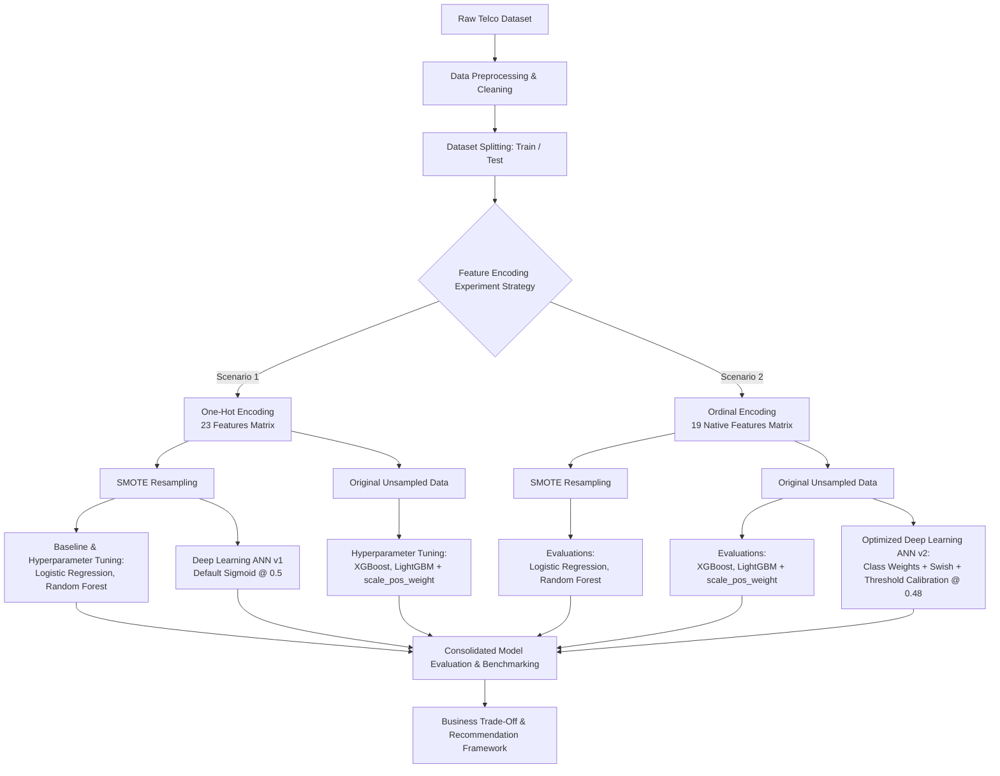

  
[1]: https://github.com/mherlypratama
[2]: https://www.linkedin.com/in/mherlypratama/

[][1]
[][2]

# 
Customer Churn Prediction: Machine Learning & Deep Learning Approach

## About The Project

This project focuses on building an end-to-end predictive framework to accurately identify customers who are at risk of churning (canceling their subscription/service). By leveraging a combination of traditional Machine Learning algorithms, hyperparameter tuning, and Deep Learning architectures, this project aims to evaluate and compare different modeling techniques to determine the optimal solution for proactive customer retention.

## Project Background

Customer acquisition is significantly more expensive than customer retention. In competitive industries such as telecommunications, customer loss directly leads to substantial revenue degradation. Identifying early warning signals of churn enables businesses to implement targeted retention strategies, personalize customer outreach, and optimize marketing spending. By shifting from a reactive to a proactive strategy driven by data, companies can preserve customer lifetime value (CLV) and maintain sustainable business growth.

## Project Objectives

- **Predictive Accuracy & Recall Optimization:** Develop machine learning and deep learning models that effectively detect potential churners, focusing particularly on maximizing recall/ROC-AUC to minimize false negatives (unidentified churners).
- **Hyperparameter Optimization:** Conduct systematic hyperparameter tuning to refine model performance and prevent overfitting.
- **Model Comparison:** Compare baseline statistical models, ensemble machine learning methods (e.g., XGBoost, LightGBM, Random Forest), and Neural Networks/Deep Learning architectures to find the best performing pipeline.
- **Business Impact & Decision Making:** Translate model predictions into actionable business insights that optimize retention campaigns and mitigate revenue loss.

---

## Dataset Overview

The dataset contains **7,043 customer records** with **21 feature columns**, capturing customer demographics, subscribed services, account details, and churn status.

[Dataset](https://github.com/mherlypratama/Churn-Prediction/blob/main/Scripts/data.csv)

### Feature Description

- **Customer Demographic Information:**

  - `customerID`: Unique identifier for each customer.
  - `gender`: Gender of the customer (`Male`, `Female`).
  - `SeniorCitizen`: Whether the customer is a senior citizen (`1`, `0`).
  - `Partner`: Whether the customer has a partner (`Yes`, `No`).
  - `Dependents`: Whether the customer has dependents (`Yes`, `No`).

- **Subscribed Services:**

  - `tenure`: Number of months the customer has stayed with the company.
  - `PhoneService`: Whether the customer has a phone service (`Yes`, `No`).
  - `MultipleLines`: Whether the customer has multiple lines (`Yes`, `No`, `No phone service`).
  - `InternetService`: Customer’s internet service provider (`DSL`, `Fiber optic`, `No`).
  - `OnlineSecurity`, `OnlineBackup`, `DeviceProtection`, `TechSupport`, `StreamingTV`, `StreamingMovies`: Additional services subscribed (`Yes`, `No`, `No internet service`).

- **Account & Financial Information:**

  - `Contract`: The contract term of the customer (`Month-to-month`, `One year`, `Two year`).
  - `PaperlessBilling`: Whether the customer has paperless billing (`Yes`, `No`).
  - `PaymentMethod`: Payment method (`Electronic check`, `Mailed check`, `Bank transfer (automatic)`, `Credit card (automatic)`).
  - `MonthlyCharges`: The amount charged to the customer monthly.
  - `TotalCharges`: The total amount charged to the customer (Note: Requires data type conversion from `object` to `float`).

- **Target Variable:**
  - `Churn`: Whether the customer churned or not (`Yes`, `No`).

---

## Expected Project Deliverables & Results

1. **Exploratory Data Analysis (EDA):** Insights into key drivers of churn (e.g., contract types, tenure, monthly charges).
2. **Data Preprocessing & Feature Engineering Pipeline:** Cleaned data handling missing values, encoding categorical variables, scaling, and feature transformation.
3. **Machine Learning & Deep Learning Benchmarks:** A structured comparison matrix comparing evaluation metrics (Accuracy, Precision, Recall, F1-Score, ROC-AUC) across multiple models.
4. **Tuned & Finalized Prediction Model:** An optimized, production-ready model artifact capable of predicting churn probability for new customer data.
5. **Business Recommendations:** Practical data-driven strategies to improve customer retention based on feature importance and model insights.

# End-to-End Customer Churn Prediction & Model Optimization

## Executive Summary

Customer churn poses a critical financial risk in the telecommunications industry, where acquiring new customers costs significantly more than retaining existing ones. This project delivers an end-to-end Machine Learning and Deep Learning pipeline designed to identify potential churners early, enabling data-driven customer retention strategies.

Rather than relying on a single baseline, this repository documents an empirical, hypothesis-driven experimentation framework comparing:

1. **Feature Engineering Strategies:** One-Hot Encoding (23 features) vs. Ordinal Encoding (19 native features).
2. **Imbalance Mitigation:** Synthetic Oversampling (SMOTE) vs. Cost-Sensitive Weighting (`scale_pos_weight` / `class_weight`).
3. **Model Families:** Regularized Linear Models (Logistic Regression), Bagging (Random Forest), Gradient Boosting (XGBoost & LightGBM), and Deep Neural Networks (Multi-Layer Perceptron).

---

## Technical Pipeline & Experiment Architecture

